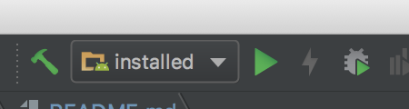
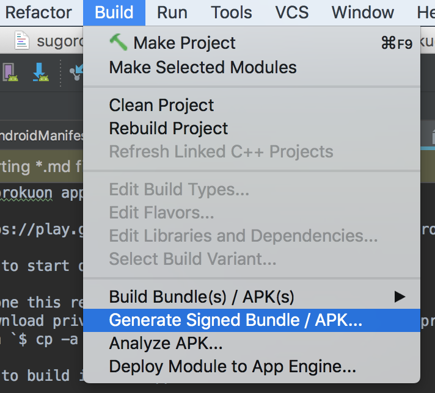
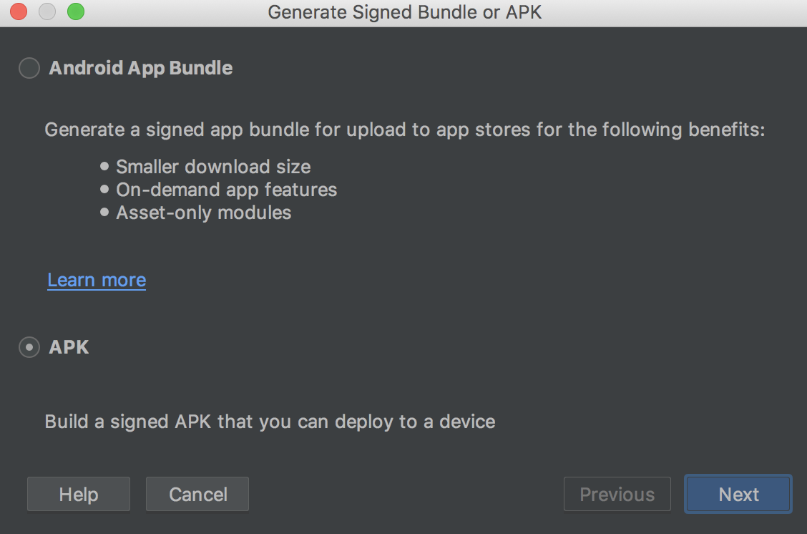

# Sugorokuon app

- https://play.google.com/store/apps/details?id=tsuyogoro.sugorokuon

# How to start development

1. Clone this repository
2. Download private keys from google drive (managed in private drive)
3. Run `$ cp -a <Downloaded keys dir> <cloned dir>`

# How to build instant app

This app is supporting instant app. Please follow below to try/develop it.

## For development

- Just run instant configuration

## For release

1. Cherry-pick <TODO> to configure gradle files
  - without this patch, package will be `tsuyogoro.sugorokuon.base` (not `tsuyogoro.sugorokuon`)
2. Select "Build > Generate Signed Bundle/Apk" (in case of Android studio 3.2 beta)
  - 
3. Select "App", then follow steps
  - 
  
